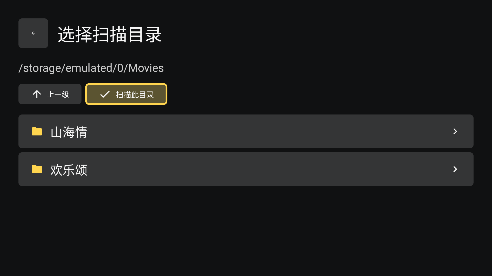
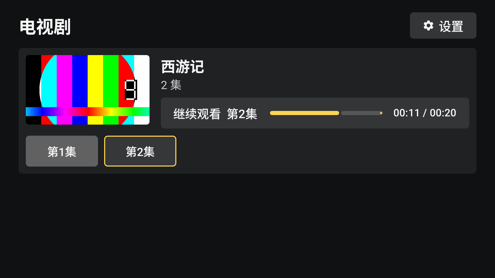
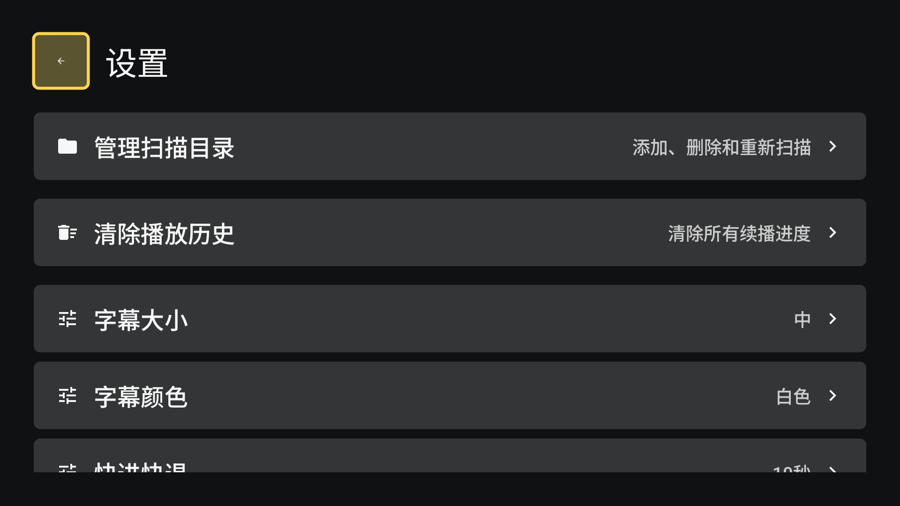

# 简易电视播放器

面向 Android TV 的本地电视剧播放器原型。支持 SAF 目录授权、一级目录扫描、集数排序、SQLite 播放历史、续播、Media3 播放、快进快退、倍速和设置页面。

> 本项目源码全程由 [Codex](https://openai.com/index/introducing-codex/) 自动生成（含代码、README、构建配置与示例数据），可作 AI 编程的参考样例。

## 特性

- **外接存储直接播放**：通过 SAF 目录授权读取 U 盘 / SD 卡 / 移动硬盘中的电视剧，无需全盘存储权限，兼容 Android 5+。
- **自动扫描建库**：扫描授权目录下的一级子目录，每个子目录即一部电视剧；视频需为受支持扩展名、非隐藏且不小于 10 MB。
- **智能剧集排序**：自动解析文件名中的集数（如 EP01、第 1 集）按序排列，无法识别时按字母序兜底。
- **断点续播**：本地记录每集观看进度，进入即提示「继续观看」；进度达到 95% 自动视为已看完。**特别地，打开 App 会自动定位到最近一次播放的剧集并继续播放**（无需手动寻找上次看到哪）。
- **完整播放控制**：基于 Media3 ExoPlayer，支持快进 / 快退、倍速播放与进度记忆。
- **老年电视端体验**：Compose + Material3 大字号界面，遥控器方向键 / 确认键操作，高亮焦点，横屏沉浸观看。
- **纯本地无打扰**：数据存于设备 SQLite，无网络请求、无广告、无统计，缩略图等能力自研实现。

## 截图

| 首页（空） | 文件浏览器 / 扫描 |
| --- | --- |
|  |  |

| 首页（已扫描） | 设置页 |
| --- | --- |
|  |  |

| 播放页（控制遮罩） |
| --- |
|  |

## 遥控器操作

全程使用遥控器方向键与确认键即可完成所有操作。

| 按键 | 通用行为 |
| --- | --- |
| `↑ ↓ ← →` | 移动焦点 |
| `OK` / `确认` | 选中当前项 |
| `返回` | 返回上一层（首页上无效果） |

### 首页

- 空库时焦点在「添加扫描目录」，按确认进入目录管理。
- 有剧集时：`↑/↓` 在剧集间移动；**海报上快速连按两次确认**即可从上次进度续播（无历史则从第 1 集开始）。
- 选中「继续观看」（带进度条）→ 按集续播；`第 N 集` 按钮 → 从头播放该集。
- 右上角「设置」进入设置页。

### 目录与扫描

- 「管理扫描目录」：每部已扫目录可**删除**；下方「添加目录」「重新扫描」。
- 文件浏览器：选择文件夹进入下级目录，「上一级」返回；定位到存放电视剧的文件夹后按「扫描此目录」，会弹进度框显示「已找到 N 部电视剧」。
- 目录只扫描一层子目录，每个子目录视为一部电视剧。

### 设置页

| 设置项 | 可选项 |
| --- | --- |
| 管理扫描目录 | 跳转目录管理 |
| 清除播放历史 | 清空所有续播进度（弹窗确认） |
| 字幕大小 | 小 / 中 / 大 / 特大 |
| 字幕颜色 | 白 / 黄 / 绿 |
| 快进快退 | 5 / 10 / 30 秒 |
| 自动续播 | 开 / 关（本集结束自动播放下一集） |

### 播放页

进入播放默认显示控制遮罩，3 秒无操作自动隐藏，**按任意键可重新唤出**。遮罩上从左到右为「上一集 / 播放·暂停 / 下一集」，用 `←/→` 选择、`OK` 激活（首尾集不可达项自动禁用）。

| 操作 | 遮罩隐藏时 | 遮罩显示时 |
| --- | --- | --- |
| `←` / `→` 短按 | 快退 / 快进（默认 10 秒，可在设置调整） | 在上一集、播放·暂停、下一集间移动选择 |
| `←` / `→` 长按 | 连续快退 / 快进 | 同样连续快退 / 快进（松手不会误切到「上一集 / 下一集」） |
| `OK` / `确认` | 播放 / 暂停 | 激活当前选中的控制按钮 |
| `OK` 长按（按住不放） | 以 2.0x 倍速播放，松开恢复 1.0x | — |
| `⏪` / `⏩` | 快退 / 快进（等效短按方向键） | — |
| `▶` / `⏸` | 播放 / 暂停 | — |
| `返回` | 退出播放，回到首页 | 收起遮罩，回到画面 |

一集播放结束后若「自动续播」开启会自动进入下一集。

## 构建

```powershell
./gradlew.bat assembleDebug
./gradlew.bat testDebugUnitTest
```

APK 输出在 `app/build/outputs/apk/debug/app-debug.apk`。应用最低 API 21，目标 API 34，ABI 列表 `armeabi-v7a / arm64-v8a / x86 / x86_64`，默认使用 Android TV 运行环境。

## 参考

- [OwnTV](https://github.com/ahXN00/OwnTV)
- [DangoPlayer](https://github.com/brunochanrio/DangoPlayer)
- [local-tv](https://github.com/outmanwt/local-tv)